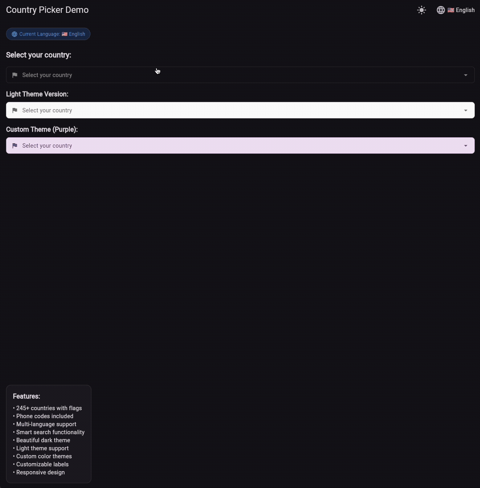
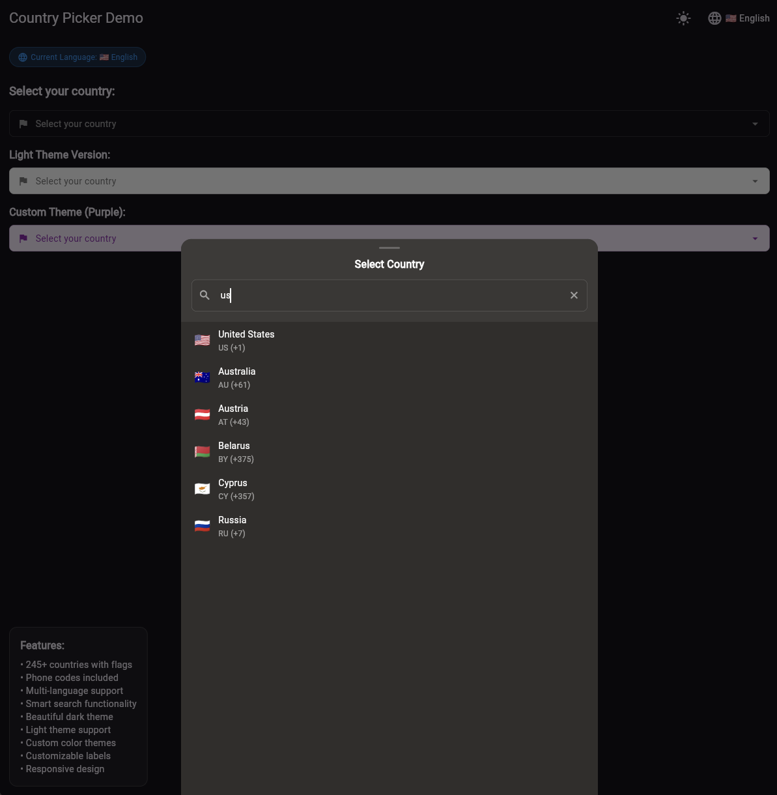
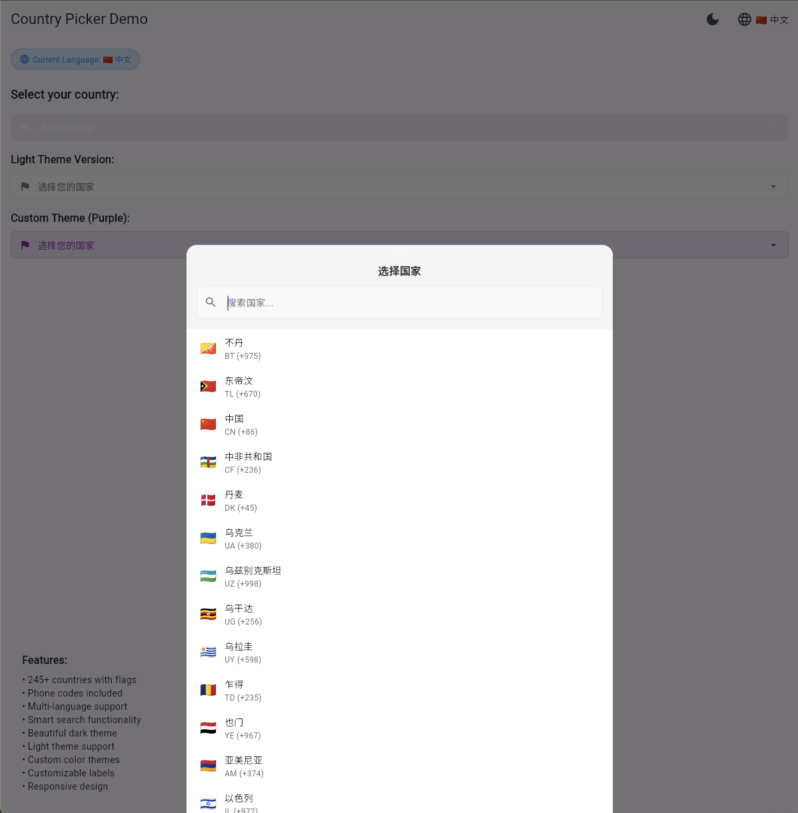

# Country Search

A beautiful and customizable country picker widget for Flutter with multi-language support and phone codes.



## 📦 Package Size & Performance

**Package Size:** ~113KB (source code, 10 languages)

**Search Performance:**
- **Algorithm:** Optimized single-pass search with early exit
- **Speed:** ~110 microseconds per query (4.7x faster than previous version)
- **Lightweight components** instead of heavy Material widgets

## ✨ Features

- 🌍 **246 Countries** with flags, ISO codes, and phone codes
- 🌐 **Multi-language Support** - English, Spanish, French, German, Italian, Japanese, Korean, Portuguese, Russian, Chinese
- 🔍 **Smart Search** by country name, code, or phone code
- ⚡ **Lightning Fast Search** - 4.7x faster than previous versions
- 📞 **Phone Codes** - Complete international dialing codes
- 🎨 **Adaptive Design** for mobile, tablet and desktop
- ⚡ **Lightweight** - only Flutter SDK
- 🔧 **Highly Customizable** - easily disable unwanted features
- 🌐 **Cross-Platform** - works on mobile, web, and desktop
- 📱 **Weak Device Optimized** - minimalist UI for smooth performance on low-end devices






## 📦 Installation

```yaml
dependencies:
  country_search: ^2.4.0
```

## 🚀 Usage

### Basic Usage (English by default)

```dart
import 'package:country_search/country_search.dart';

CountryPicker(
  selectedCountry: selectedCountry,
  onCountrySelected: (Country country) {
    setState(() {
      selectedCountry = country;
    });
    debugPrint('Selected: ${country.flag} ${country.code} (${country.phoneCode})');
  },
  showPhoneCodes: true, // Show phone codes (default)
)
```

**✅ Works immediately without any setup!** The widget uses English by default.


### Run the Example

To see the widget in action, run the example app:

```bash
cd example
flutter run
```

The example demonstrates:
- ✅ Multi-language support (10 languages)
- ✅ Country search by name, code, and phone code
- ✅ Beautiful dark theme UI
- ✅ Responsive design for all screen sizes
- ✅ Optimized performance for weak devices


## 🔧 Customization

### Show/Hide Phone Codes

Control whether phone codes are displayed in the country list:

```dart
// Show phone codes (default)
CountryPicker(
  selectedCountry: selectedCountry,
  onCountrySelected: (Country country) {
    setState(() {
      selectedCountry = country;
    });
  },
  showPhoneCodes: true, // Default behavior
)
```

### Customize Colors

Easily customize the widget colors for different themes:

```dart
// Dark theme (default)
CountryPicker(
  selectedCountry: selectedCountry,
  onCountrySelected: (Country country) {
    setState(() {
      selectedCountry = country;
    });
  },
)

// Light theme
CountryPicker(
  selectedCountry: selectedCountry,
  onCountrySelected: (Country country) {
    setState(() {
      selectedCountry = country;
    });
  },
  backgroundColor: Colors.white,
  headerColor: Colors.grey.shade100,
  textColor: Colors.black87,
  accentColor: Colors.blue,
  searchFieldColor: Colors.grey.shade50,
  searchFieldBorderColor: Colors.grey.shade300,
  cursorColor: Colors.blue,
  hintTextColor: Colors.grey.shade600,
)
```

### Multi-Language Support

The widget works with English by default. For multi-language support, add delegates to your MaterialApp:

```dart
// If you don't have delegates yet:
MaterialApp(
  localizationsDelegates: CountrySearchDelegates.allDelegates,
  supportedLocales: CountrySearchDelegates.supportedLocales,
  // ... rest of your app
)

// If you already have delegates, add ours:
MaterialApp(
  localizationsDelegates: [
    // Your existing delegates
    GlobalMaterialLocalizations.delegate,
    GlobalWidgetsLocalizations.delegate,
    // Add our delegate
    CountryLocalizations.delegate,
  ],
  supportedLocales: [
    // Your existing locales
    const Locale('en'),
    const Locale('de')
  ],
)
```
## 🗂️ Customization

### Remove Unused Languages

To reduce package size, remove language files you don't need:

```bash
rm lib/src/flutter_country_picker/localizations/country_localizations_es.dart
```

**Then update the main localization file:**
- Remove imports for deleted languages from `lib/src/flutter_country_picker/localizations/country_localizations.dart`
- Remove language codes from `supportedLocales` list in the same file
- Remove cases from `lookupCountryLocalizations` function in the same file

**⚠️ Important:** If you don't update the main localization file, you'll get compilation errors because the code will try to import and reference deleted language files.


## 🌍 Supported Languages

- 🇺🇸 English
- 🇷🇺 Russian  
- 🇪🇸 Spanish
- 🇫🇷 French
- 🇩🇪 German
- 🇮🇹 Italian
- 🇯🇵 Japanese
- 🇰🇷 Korean
- 🇵🇹 Portuguese
- 🇨🇳 Chinese


## 📝 License

MIT License - see [LICENSE](LICENSE) file.

## 👨‍💻 Author

**Stanislav Bozhko**  
Email: stas.bozhko@gmail.com  
GitHub: [@stanislavworldin](https://github.com/stanislavworldin)

## ☕ Support

If you find this package helpful, consider buying me a coffee! ☕

[](https://ko-fi.com/stanislavbozhko) 